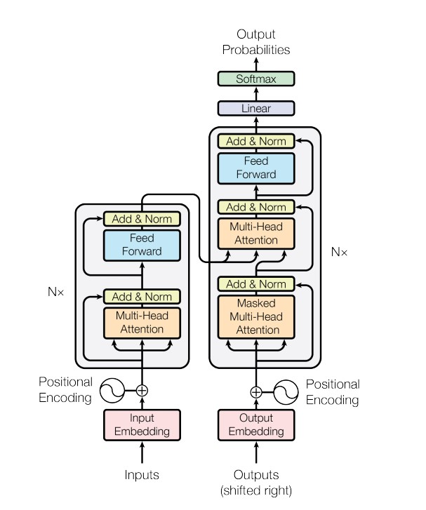
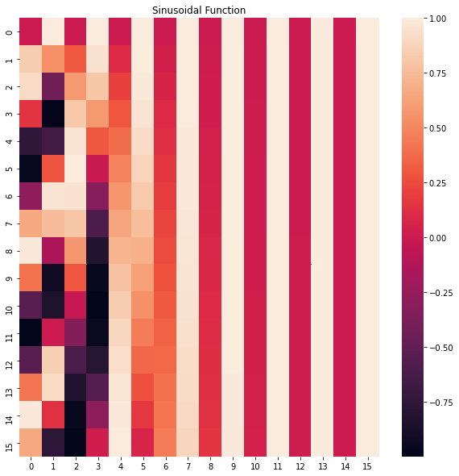
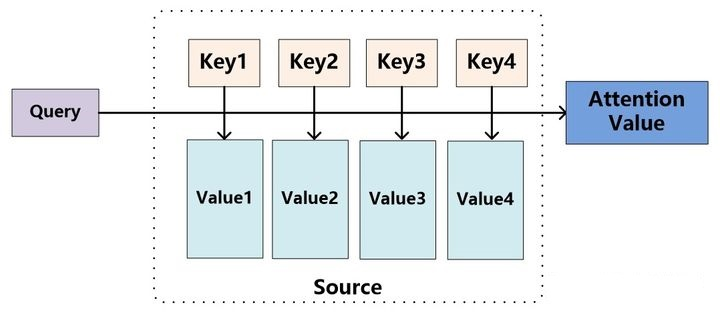
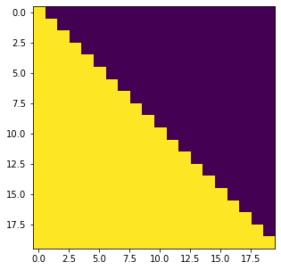
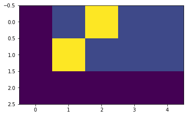
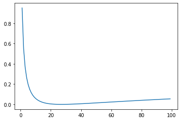

# transformer初探

- **Writer** : 永驻
- **Date** : 2021.10.14

2017年谷歌在一篇名为《Attention Is All You Need》的论文中,提出了一个基于attention(自注意力机制)结构来处理序列相关的问题的模型，名为Transformer。**Transformer模型摒弃了固有的定式，并没有用任何CNN或者RNN的结构，而是使用了`Attention注意力机制`，自动捕捉输入序列不同位置处的相对关联，善于处理较长文本，并且该模型可以高度并行地工作，训练速度很快。**

## 模型架构


根据模型架构图，可以看出模型大致分为`**Encoder(编码器)**`和`**Decoder(解码器)**`两个部分，分别对应上图中的左右两部分。

* 其中编码器由N个相同的层堆叠在一起，每一层又有两个子层。第一个子层是一个`Multi-Head Attention`(**多头的自注意机制**)，第二个子层是一个简单的`Feed Forward`(**全连接前馈网络**)。两个子层都添加了一个 **残差连接+layer normalization**的操作。

* 模型的解码器同样是堆叠了N个相同的层，不过和编码器中每层的结构稍有不同。对于解码器的每一层，除了编码器中的两个子层`Multi-Head Attention`和`Feed Forward`，解码器还包含一个子层`Masked Multi-Head Attention`，如图中所示每个子层同样也用了residual +ayer normalization。
* 模型的输入由`Input Embedding`和`Positional Encoding`(**位置编码**)两部分组合而成，模型的输出由Decoder的输出简单的经过softmax得到。
我们下面通过代码，来实现各个模块


## 模型输入
### 1.Embeddings
`Embedding`层的作用是将某种格式的输入数据，例如文本，转变为模型可以处理的向量表示，来描述原始数据所包含的信息。  
`Embedding`层输出的可以理解为**当前时间步的特征**，如果是文本任务，这里就可以是Word Embedding，如果是其他任务，就可以是任何合理方法所提取的特征。
`Embedding`技术在NLP中应用广泛，其中细节不做赘述。
***  
使用torch中Embedding模块来构建:
```python
class Embeddings(nn.Module):
    def __init__(self, d_model, vocab):
        """
        类的初始化函数
        d_model：指词嵌入的维度
        vocab:指词表的大小
        """
        super(Embeddings, self).__init__()
        # 之后就是调用nn中的预定义层Embedding，获得一个词嵌入对象self.lut
        self.lut = nn.Embedding(vocab, d_model)
        # 最后就是将d_model传入类中
        self.d_model = d_model

    def forward(self, x):
        """
        Embedding层的前向传播逻辑
        参数x：这里代表输入给模型的单词文本通过词表映射后的one-hot向量
        将x传给self.lut并与根号下self.d_model相乘作为结果返回
        """
        embedds = self.lut(x)
        return embedds * math.sqrt(self.d_model)
```
***
#### 对Embedding模块进行测试
``` python
embedding = Embeddings(16, 10)
print(embedding)
input_X = torch.randint(0, 10, (1, 5))
print(input_X)
print(input_X.shape)
embedd_X = embedding(input_X)
print(embedd_X)
embedd_X.shape
```
输出如下
``` python
Embeddings(
  (lut): Embedding(10, 16)
)
tensor([[4, 5, 8, 8, 1]])
torch.Size([1, 5])
tensor([[[  9.7116,  -3.2952,   0.5219,  -1.2501,   5.5110,  -2.7993,   3.2012,
            4.9364,   0.3486,  -2.7039,   2.6776,  11.0604,  -6.9241,   3.0686,
           -0.6369,   5.2696],
         [  0.5425,   3.5664,  -2.1441,  -4.5084,   4.4102,   4.9775,   2.0334,
           -0.1824, -10.1114,  -0.7900,  -3.0759,  -7.8962,   0.9425,   0.4546,
           -1.2102,  -2.6575],
         [  1.2518,   2.5849,   2.3994,   9.0222,   5.8251,   2.5319,   1.4701,
            4.1769,  -6.3250,   7.2940,  -0.4277,  -0.3020,  -1.5351,  -6.7384,
           -4.4161,  -4.0305],
         [  1.2518,   2.5849,   2.3994,   9.0222,   5.8251,   2.5319,   1.4701,
            4.1769,  -6.3250,   7.2940,  -0.4277,  -0.3020,  -1.5351,  -6.7384,
           -4.4161,  -4.0305],
         [ -3.5904,  -9.1608,   3.9014,  -1.4941,   6.0639,  -6.8471,   0.7589,
            6.4332,  -2.2029,   3.1529,   4.8142,   7.7268,  11.5662,   6.0759,
           -7.6120,  -7.0156]]], grad_fn=<MulBackward0>)
torch.Size([1, 5, 16])
```
***

### 2.Positional Encoding
`Positional Encodding`位置编码的作用是为模型提供当前时间步的前后出现顺序的信息。因为Transformer不像RNN那样的循环结构有前后不同时间步输入间天然的先后顺序，所有的时间步是同时输入，并行推理的，因此需要在时间步的特征中融合进位置编码。

`Positional Encoding`和`token embedding`相加，作为encoder和decoder栈的底部输入。`Positional Encoding`和`embedding`具有同样的维度$d_{model}$，因此这两者可以直接相加**

**位置编码选择多样，可以是固定的，也可以设置为`可学习的参数`**
我们选择固定的位置编码。在论文中使用不同频率的sin和cos函数来进行位置编码，如下所示：

$$PE_{pos,2i}=sin(pos/10000^{2i/d_{model}})$$         
$$PE_{pos,2i+1}=cos(pos/10000^{2i/d_{model}})$$
可以绘制出这两个函数的图像：
 
蓝色为sin, 绿色为cos
*这里感谢shenhao大佬提供公式可视化工具，减少工作量*   [公式可视化工具](https://www.geogebra.org/calculator)

`Positional Encoding`需要满足以下两点：
- **每个位置有一个唯一的positional encoding**  

-  **两个位置之间的关系可以通过他们位置编码间的仿射变换来建模（获得）。**
而上述定义的公式，刚好可以满足，


***
具体代码实现
``` python
class PositionalEncoding(nn.Module):
    def __init__(self, d_model, dropout, max_len=5000):
        """
        位置编码器类的初始化函数
        
        共有三个参数，分别是
        d_model：词嵌入维度
        dropout: dropout触发比率
        max_len：每个句子的最大长度
        """
        super(PositionalEncoding, self).__init__()
        self.dropout = nn.Dropout(p=dropout)
        
        # Compute the positional encodings
        # 注意下面代码的计算方式与公式中给出的是不同的，但是是等价的，你可以尝试简单推导证明一下。
        # 这样计算是为了避免中间的数值计算结果超出float的范围，
        pe = torch.zeros(max_len, d_model)
        position = torch.arange(0, max_len).unsqueeze(1)
        div_term = torch.exp(torch.arange(0, d_model, 2) *
                             -(math.log(10000.0) / d_model))
        pe[:, 0::2] = torch.sin(position * div_term)
        pe[:, 1::2] = torch.cos(position * div_term)
        pe = pe.unsqueeze(0)
        self.register_buffer('pe', pe)
        
    def forward(self, x):
        x = x + Variable(self.pe[:, :x.size(1)], requires_grad=False)
        return self.dropout(x)
```
注意，上述输出是输入向量与Postinal Encoding的加和


#### 对Positional Encodding模块进行测试
```python
PE = PositionalEncoding(16, 0)
print(PE)
input_X = torch.randint(1, 128, (1, 16))
print(input_X)
print(input_X.shape)
P_encoding = PE(input_X)
print(P_encoding)
plt.figure(figsize=(10, 10))
sns.heatmap(P_encoding[0])
```
输出结果如下：
``` python
PositionalEncoding(
  (dropout): Dropout(p=0, inplace=False)
)
tensor([[ 98,  39,   2,  12,  21,  36, 113,  94,  90,  79,  38,  82,  99,  56,
          82, 111]])
torch.Size([1, 16])
tensor([[[ 0.0000e+00,  1.0000e+00,  0.0000e+00,  1.0000e+00,  0.0000e+00,
           1.0000e+00,  0.0000e+00,  1.0000e+00,  0.0000e+00,  1.0000e+00,
           0.0000e+00,  1.0000e+00,  0.0000e+00,  1.0000e+00,  0.0000e+00,
           1.0000e+00],
         [ 8.4147e-01,  5.4030e-01,  3.1098e-01,  9.5042e-01,  9.9833e-02,
           9.9500e-01,  3.1618e-02,  9.9950e-01,  9.9998e-03,  9.9995e-01,
           3.1623e-03,  9.9999e-01,  1.0000e-03,  1.0000e+00,  3.1623e-04,
           1.0000e+00],

           ...
```




***

### 3.Encoder和Decoder都包含输入模块

编码器和解码器两个部分都包含输入，且两部分的输入的结构是相同的，只是推理时的用法不同
-  编码器只**推理一次**
- 解码器是类似RNN那样循环推理，**不断生成预测结果**


假设我们现在做的是一个法语-英语的机器翻译任务，想把`Je suis étudiant`翻译为`I am a student`
那么我们输入给编码器的就是时间步数为3的embedding数组，编码器只进行一次并行推理，即获得了对于输入的法语句子所提取的若干特征信息。
而对于解码器，是循环推理，逐个单词生成结果的。最开始，由于什么都还没预测，我们会将编码器提取的特征，以及一个句子起始符传给解码器，解码器预期会输出一个单词`I`。然后有了预测的第一个单词，我们就将I输入给解码器，会再预测出下一个单词`am`，再然后我们将`I am`作为输入喂给解码器，以此类推直到预测出句子终止符完成预测。

## 1. Encoder
编码器部分原理及实现
### 1.1编码器结构
每个编码器层由两个子层连接结构组成

第一个子层包括一个**多头自注意力层**和**规范化层**以及一个残差连接

第二个子层包括一个**前馈全连接层**和**规范化层**以及一个残差连接

如下图所示：

两个子层的结构其实是一致的，只是中间核心层的实现不同

我们逐步构建出整个编码器结构

### 1.2规范化层
规范化层的作用：它是所有深层网络模型都需要的标准网络层，因为随着网络层数的增加，通过多层的计算后输出可能开始出现过大或过小的情况，这样可能会导致学习过程出现异常，模型可能收敛非常慢。因此都会在一定层后接规范化层进行数值的规范化，使其特征数值在合理范围内。
***
Transformer中使用的normalization手段是layer norm，实现代码如下：
```python
class LayerNorm(nn.Module):
    "Construct a layernorm module (See citation for details)."
    def __init__(self, feature_size, eps=1e-6):
        #初始化函数有两个参数，一个是features,表示词嵌入的维度,另一个是eps它是一个足够小的数，在规范化公式的分母中出现,防止分母为0，默认是1e-6。
        super(LayerNorm, self).__init__()
        #根据features的形状初始化两个参数张量a2，和b2，第一初始化为1张量，也就是里面的元素都是1，第二个初始化为0张量，也就是里面的元素都是0，这两个张量就是规范化层的参数。因为直接对上一层得到的结果做规范化公式计算，将改变结果的正常表征，因此就需要有参数作为调节因子，使其即能满足规范化要求，又能不改变针对目标的表征，最后使用nn.parameter封装，代表他们是模型的参数
        self.a_2 = nn.Parameter(torch.ones(feature_size))
        self.b_2 = nn.Parameter(torch.zeros(feature_size))
        #把eps传到类中
        self.eps = eps

    def forward(self, x):
    #输入参数x代表来自上一层的输出，在函数中，首先对输入变量x求其最后一个维度的均值，并保持输出维度与输入维度一致，接着再求最后一个维度的标准差，然后就是根据规范化公式，用x减去均值除以标准差获得规范化的结果。
    #最后对结果乘以我们的缩放参数，即a2,*号代表同型点乘，即对应位置进行乘法操作，加上位移参b2，返回即可
        mean = x.mean(-1, keepdim=True)
        std = x.std(-1, keepdim=True)
        return self.a_2 * (x - mean) / (std + self.eps) + self.b_2
```
***
由于规范化层很简单，我们不做测试了。

### 1.3 Attention
人类在观察事物时，无法同时仔细观察眼前的一切，只能聚焦到某一个局部。通常我们大脑在简单了解眼前的场景后，能够很快把注意力聚焦到最有价值的局部来仔细观察，从而作出有效判断。或许是基于这样的启发，大家想到了在算法中利用注意力机制。
计算方式：
三个指定的输入:$Q(query)$, $K(key)$, $V(value)$


计算公式：**$Attention(Q, K, V) = softmax(\frac{QK^T}{\sqrt(d_{k})})V$**



Attention 功能可以描述为将 query 和一组 key-value 映射到输出，其中 query、key、value 和输出都是向量。输出为 value 的加权和，其中每个 value 的权重通过 query 与相应 key 的计算得到。

particular attention 称之为“缩放的点积 Attention”(Scaled Dot-Product Attention")。其输入为 query、key(维度是$d_k$)以及 values(维度是$d_v$)。我们计算 query 和所有 key 的点积，然后对每个除以 $\sqrt{d_k}$, 最后用 softmax 函数获得 value 的权重。

计算流程图：

当前时间步的注意力计算结果，**是一个组系数 * 每个时间步的特征向量value的累加**，而这个系数，通过**当前时间步的query和其他时间步对应的key做内积**得到，这个过程相当于**用自己的query对别的时间步的key做查询，判断相似度，决定以多大的比例将对应时间步的信息继承过来**。

Attention 能够**捕获长距离依赖**，并且能够**学习到句子内部结构及语法**

***
代码实现如下：
```python
def attention(query, key, value, mask=None, dropout=None):
    "Compute 'Scaled Dot Product Attention'"

    #首先取query的最后一维的大小，对应词嵌入维度
    d_k = query.size(-1)
    #按照注意力公式，将query与key的转置相乘，这里面key是将最后两个维度进行转置，再除以缩放系数得到注意力得分张量scores
    scores = torch.matmul(query, key.transpose(-2, -1)) / math.sqrt(d_k)
    
    #接着判断是否使用掩码张量
    if mask is not None:
        #使用tensor的masked_fill方法，将掩码张量和scores张量每个位置一一比较，如果掩码张量则对应的scores张量用-1e9这个置来替换
        scores = scores.masked_fill(mask == 0, -1e9)
        
    #对scores的最后一维进行softmax操作，使用F.softmax方法，这样获得最终的注意力张量
    p_attn = F.softmax(scores, dim = -1)
    
    #之后判断是否使用dropout进行随机置0
    if dropout is not None:
        p_attn = dropout(p_attn)
    
    #最后，根据公式将p_attn与value张量相乘获得最终的query注意力表示，同时返回注意力张量
    return torch.matmul(p_attn, value), p_attn
```

测试一下
```python
query, key, value = [torch.randn((1, 5, 16)) for i in range(3)]
output_x = attention(query,key,value)
print(output_x)
output_x[0].shape,output_x[1].shape
```
结果如下：
```python
(tensor([[[-0.6050,  0.9089,  0.1501,  0.5252,  0.0172, -0.4108,  0.2845,
          -0.5107, -1.3031,  0.6896, -0.5409, -0.3474,  0.4047, -0.0065,
           0.1786,  0.2950],
         [-1.3620,  0.7315,  0.0526, -1.1516, -0.5849,  0.4321, -0.4097,
          -1.1967, -1.8463,  1.0860, -0.0272, -0.0928,  0.1556,  0.0442,
           0.5916, -0.1987],
         [-0.9837, -0.0544,  0.9158,  0.1644,  0.1860, -0.0890,  1.0868,
          -0.7223,  0.1227,  0.3533, -0.0941,  0.5415,  2.0633,  0.5031,
           0.3155,  0.0870],
         [-0.7971,  0.6691,  0.3577,  0.5808,  0.1980, -0.3161,  0.5929,
          -0.6528, -0.9138,  0.5924, -0.6598, -0.1999,  0.9092,  0.1587,
           0.2123,  0.2456],
         [-1.0944,  0.6437,  0.0207, -1.2351, -0.6719,  0.2364, -0.5099,
          -0.9197, -1.8187,  1.1593,  0.4747,  0.1265,  0.1891,  0.0736,
           0.4798,  0.0239]]]), tensor([[[0.2140, 0.2028, 0.2461, 0.0508, 0.2863],
         [0.2294, 0.6981, 0.0154, 0.0243, 0.0328],
         [0.1151, 0.0305, 0.1626, 0.6680, 0.0237],
         [0.2521, 0.1176, 0.1942, 0.2333, 0.2028],
         [0.0707, 0.7108, 0.0588, 0.0027, 0.1569]]]))
(torch.Size([1, 5, 16]), torch.Size([1, 5, 5]))
```
***

### 1.4 多头注意力机制
在搭建EncoderLayer时候所使用的Attention模块，实际使用的是**多头注意力**，可以简单理解为多个注意力模块组合在一起。


- **它扩展了模型关注不同位置的能力:** 在上面的例子中，第一个位置的输出 $z_1$ 包含了句子中其他每个位置的很小一部分信息，但$z_1$​ 仅仅是单个向量，所以可能仅由第 1 个位置的信息主导了。而当我们翻译句子：The animal didn’t cross the street because it was too tired时，我们不仅希望模型关注到"it"本身，还希望模型关注到"The"和"animal"，甚至关注到"tired"。这时，多头注意力机制会有帮助。
- **多头注意力机制赋予 attention 层多个“子表示空间”:** 下面我们会看到，多头注意力机制会有多组 $W^Q, W^K W^V$ 的权重矩阵（在 Transformer 的论文中，使用了 8 组注意力),，因此可以将 $X$ 变换到更多种子空间进行表示。接下来我们也使用 8 组注意力头（attention heads））。每一组注意力的权重矩阵都是随机初始化的，但经过训练之后，每一组注意力的权重 $W^Q, W^K W^V$ 可以把输入的向量映射到一个对应的"子表示空间"。

多头注意力机制主要有以下几步组成

1. 在多头注意力机制中，我们为每组注意力设定单独的 $W_Q$, $W_K$, $W_V$ 参数矩阵。将输入 $X$ 和每组注意力的 $W_Q$, $W_K$, $W_V$ 相乘，得到 8 组 $Q$, $K$, $V$ 矩阵。


2. 把每组 $K$, $Q$, $V$ 计算得到每组的 $Z$ 矩阵，就得到 8 个 $Z$ 矩阵


3. 由于前馈神经网络层接收的是 1 个矩阵（其中每行的向量表示一个词），而不是 8 个矩阵，所以我们直接把 8 个子矩阵拼接起来得到一个大的矩阵，然后和另一个权重矩阵$W^O$相乘做一次变换，映射到前馈神经网络层所需要的维度。


##### MutiHeadAttention 小结：
- 把 8 个矩阵 {$Z_0$,$Z_1$...,$Z_7$} 拼接起来

- 把拼接后的矩阵和$W_O$权重矩阵相乘

- 得到最终的矩阵 Z，这个矩阵包含了所有 ***attention heads***（注意力头） 的信息。这个矩阵会输入到 FFNN (`Feed Forward Neural Network`)层。

将所有内容放到一张图中：


学习了多头注意力机制，让我们再来看下当我们前面提到的 it 例子，不同的 attention heads （注意力头）对应的“it”attention 了哪些内容。下图中的绿色和橙色线条分别表示 2 组不同的 attentin heads：

>>
> 当我们编码单词"it"时，其中一个 attention head （橙色注意力头）最关注的是"the animal"，另外一个绿色 attention head 关注的是"tired"。因此在某种意义上，"it"在模型中的表示，融合了"animal"和"tire"的部分表达。


这种结构设计能让**每个注意力机制去优化每个词汇的不同特征部分，从而均衡同一种注意力机制可能产生的偏差，让词义拥有来自更多元表达**，实验表明可以从而提升模型效果。

***
代码实现如下：

```python
# 定义一个clones函数，来更方便的将某个结构复制若干份
def clones(module, N):
    "Produce N identical layers."
    return nn.ModuleList([copy.deepcopy(module) for _ in range(N)])

```

```python
class MultiHeadedAttention(nn.Module):
    def __init__(self, h, d_model, dropout=0.1):
        #在类的初始化时，会传入三个参数，h代表头数，d_model代表词嵌入的维度，dropout代表进行dropout操作时置0比率，默认是0.1
        super(MultiHeadedAttention, self).__init__()
        #在函数中，首先使用了一个测试中常用的assert语句，判断h是否能被d_model整除，这是因为我们之后要给每个头分配等量的词特征，也就是embedding_dim/head个
        assert d_model % h == 0
        #得到每个头获得的分割词向量维度d_k
        self.d_k = d_model // h
        #传入头数h
        self.h = h
        
        #创建linear层，通过nn的Linear实例化，它的内部变换矩阵是embedding_dim x embedding_dim，然后使用，为什么是四个呢，这是因为在多头注意力中，Q,K,V各需要一个，最后拼接的矩阵还需要一个，因此一共是四个
        self.linears = clones(nn.Linear(d_model, d_model), 4)
        #self.attn为None，它代表最后得到的注意力张量，现在还没有结果所以为None
        self.attn = None
        self.dropout = nn.Dropout(p=dropout)
        
    def forward(self, query, key, value, mask=None):
        #前向逻辑函数，它输入参数有四个，前三个就是注意力机制需要的Q,K,V，最后一个是注意力机制中可能需要的mask掩码张量，默认是None
        if mask is not None:
            # Same mask applied to all h heads.
            #使用unsqueeze扩展维度，代表多头中的第n头
            mask = mask.unsqueeze(1)
        #接着，我们获得一个batch_size的变量，他是query尺寸的第1个数字，代表有多少条样本
        nbatches = query.size(0)
        
        # 1) Do all the linear projections in batch from d_model => h x d_k 
        # 首先利用zip将输入QKV与三个线性层组到一起，然后利用for循环，将输入QKV分别传到线性层中，做完线性变换后，开始为每个头分割输入，这里使用view方法对线性变换的结构进行维度重塑，多加了一个维度h代表头，这样就意味着每个头可以获得一部分词特征组成的句子，其中的-1代表自适应维度，计算机会根据这种变换自动计算这里的值，然后对第二维和第三维进行转置操作，为了让代表句子长度维度和词向量维度能够相邻，这样注意力机制才能找到词义与句子位置的关系，从attention函数中可以看到，利用的是原始输入的倒数第一和第二维，这样我们就得到了每个头的输入
        query, key, value = \
            [l(x).view(nbatches, -1, self.h, self.d_k).transpose(1, 2)
             for l, x in zip(self.linears, (query, key, value))]

        # 2) Apply attention on all the projected vectors in batch. 
        # 得到每个头的输入后，接下来就是将他们传入到attention中，这里直接调用我们之前实现的attention函数，同时也将mask和dropout传入其中
        x, self.attn = attention(query, key, value, mask=mask, 
                                 dropout=self.dropout)

        # 3) "Concat" using a view and apply a final linear. 
        # 通过多头注意力计算后，我们就得到了每个头计算结果组成的4维张量，我们需要将其转换为输入的形状以方便后续的计算，因此这里开始进行第一步处理环节的逆操作，先对第二和第三维进行转置，然后使用contiguous方法。这个方法的作用就是能够让转置后的张量应用view方法，否则将无法直接使用，所以，下一步就是使用view重塑形状，变成和输入形状相同。  
        x = x.transpose(1, 2).contiguous() \
             .view(nbatches, -1, self.h * self.d_k)
        #最后使用线性层列表中的最后一个线性变换得到最终的多头注意力结构的输出
        return self.linears[-1](x)
```
测试一下：
```PYTHON
# batch_size 为 64，有 12 个词，每个词的 Key 向量是 256 维
query = torch.rand(64, 12, 256)
key = torch.rand(64, 12, 256)
value = torch.rand(64, 12, 256)
attention_fn = MultiHeadedAttention(h=8, d_model=256, dropout=0.1)
output = attention_fn(query, key, value)
print(output.shape)
```
结果如下：
```python
torch.Size([64, 12, 256])
```
***

### 1.5 前馈全连接层

除了 attention 子层之外，我们的编码器和解码器中的每个层都包含一个全连接的前馈网络，**该网络在每个层的位置相同（都在每个 encoder-layer 或者 decoder-layer 的最后）**。该前馈网络包括两个**线性变换，并在两个线性变换中间有一个 ReLU 激活函数。**

$$\mathrm{FFN}(x)=\max(0, xW_1 + b_1) W_2 + b_2$$

尽管两层都是线性变换，但它们在层与层之间使用不同的参数。另一种描述方式是两个内核大小为 1 的卷积。 输入和输出的维度都是 $d_{\text{model}}=512$, 内层维度是$d_{ff}=2048$。（也就是第一层输入 512 维,输出 2048 维；第二层输入 2048 维，输出 512 维）

Feed Forward Layer 其实就是简单的由两个前向全连接层组成，核心在于，**Attention模块每个时间步的输出都整合了所有时间步的信息，而Feed Forward Layer每个时间步只是对自己的特征的一个进一步整合，与其他时间步无关。**
***
代码实现如下：
```python
class PositionwiseFeedForward(nn.Module):
    def __init__(self, d_model, d_ff, dropout=0.1):
        #=0.1，第一个是线性层的输入维度也是第二个线性层的输出维度，
        #因为我们希望输入通过前馈全连接层后输入和输出的维度不变，
        #第二个参数d_ff就是第二个线性层的输入维度和第一个线性层的输出，
        #最后一个是dropout置0比率。初始化函数有三个输入参数分别是d_model，d_ff，和dropout
        super(PositionwiseFeedForward, self).__init__()
        self.w_1 = nn.Linear(d_model, d_ff)
        self.w_2 = nn.Linear(d_ff, d_model)
        self.dropout = nn.Dropout(dropout)

    def forward(self, x):
        #输入参数为x，代表来自上一层的输出，首先经过第一个线性层，然后使用F中的relu函数进行激活，之后再使用dropout进行随机置0，最后通过第二个线性层w2，返回最终结果
        return self.w_2(self.dropout(F.relu(self.w_1(x))))

```
由于Feed Forward Layer较为简单，此处不进行测试
***

### 1.6 掩码及其作用
**掩码**： 掩代表遮掩，码就是我们张量中的数值，它的尺寸不定，里面一般只有 0 和 1；代表位置被遮掩或者不被遮掩。
**掩码的作用**
- **屏蔽掉无效的 `padding` 区域**:我们训练需要组 batch 进行，就以机器翻译任务为例，一个 batch 中不同样本的输入长度很可能是不一样的，此时我们要设置一个最大句子长度，然后对空白区域进行 padding 填充，而填充的区域无论在 Encoder 还是 Decoder 的计算中都是没有意义的，因此需要用 mask 进行标识，屏蔽掉对应区域的响应。

- **屏蔽掉来自“未来”的信息**：我们已经学习了 attention 的计算流程，它是会综合所有时间步的计算的，那么在解码的时候，就有可能获取到未来的信息，这是不行的。因此，这种情况也需要我们使用 mask 进行屏蔽。

**Encoder 中的掩码主要是起到第一个作用，Decoder 中的掩码则同时发挥着两种作用**
***
代码实现如下：
```python
def subsequent_mask(size):
    #生成向后遮掩的掩码张量，参数size是掩码张量最后两个维度的大小，
    #它最后两维形成一个方阵

    "Mask out subsequent positions."
    attn_shape = (1, size, size)
    
    #然后使用np.ones方法向这个形状中添加1元素，形成上三角阵
    subsequent_mask = np.triu(np.ones(attn_shape), k=1).astype('uint8')

    #最后将numpy类型转化为torch中的tensor，内部做一个1- 的操作。这个其实
    #是做了一个三角阵的反转，subsequent_mask中的每个元素都会被1减。
    #如果是0，subsequent_mask中的该位置由0变成1
    #如果是1，subsequect_mask中的该位置由1变成0
    return torch.from_numpy(subsequent_mask) == 0
```
测试一下：
```py
plt.figure(figsize=(5,5))
plt.imshow(subsequent_mask(20)[0])
```


***
到此，Encoder各个模块准备完毕，下面开始构建Encoder


### 1.7 Encoder层
编码器作用是用于**对输入进行特征提取，为解码环节提供有效的语义信息**

编码器由 N = 6 个完全相同的层组成。 编码器的每层 encoder 包含 `Self Attention 子层和 FFN 子层`，每个子层都使用了`残差连接(cite)，和层标准化（layer-normalization）`

我们进行以下定义：
  - 子层：$\mathrm{Sublayer}(x)$
  - 每个子层的最终输出:$\mathrm{LayerNorm}(x + \mathrm{Sublayer}(x))$
  - dropout (cite)被加在 $\mathrm{Sublayer}$ 上。
  - 为了便于进行残差连接，模型中的所有子层以及 embedding 层产生的输出的维度都为 $d_{\text{model}}=512$。

将 Self-Attention 层的层标准化（layer-normalization）和涉及的向量计算细节都进行可视化，如下所示：

***
实现代码
```python
# 定义一个clones函数，来更方便的将某个结构复制若干份
def clones(module, N):
    "Produce N identical layers."
    return nn.ModuleList([copy.deepcopy(module) for _ in range(N)])


class Encoder(nn.Module):
    """
    Encoder
    The encoder is composed of a stack of N=6 identical layers.
    """
    def __init__(self, layer, N):
        super(Encoder, self).__init__()
        # 调用时会将编码器层传进来，我们简单克隆N分，叠加在一起，组成完整的Encoder
        self.layers = clones(layer, N)
        self.norm = LayerNorm(layer.size)
        
    def forward(self, x, mask):
        "Pass the input (and mask) through each layer in turn."
        for layer in self.layers:
            x = layer(x, mask)
        return self.norm(x)

```

由于每个编码器层由两个子层连接结构组成， 两个子层的结构其实是一致的，只是中间核心层的实现不同。
我们先定义一个SubLayerConnection类来描述这种结构关系：
``` python
class SublayerConnection(nn.Module):
    """ 
    实现子层连接结构的类
    """
    def __init__(self, size, dropout):
        super(SublayerConnection, self).__init__()
        self.norm = LayerNorm(size)
        self.dropout = nn.Dropout(dropout)

    def forward(self, x, sublayer):

        # 原paper的方案
        #sublayer_out = sublayer(x)
        #x_norm = self.norm(x + self.dropout(sublayer_out))

        # 稍加调整的版本
        sublayer_out = sublayer(x)
        sublayer_out = self.dropout(sublayer_out)
        x_norm = x + self.norm(sublayer_out)
        return x_norm

```
>注：上面的实现中，我对残差的链接方案进行了小小的调整，和原论文有所不同。把x从norm中拿出来，保证永远有一条“高速公路”，这样理论上会收敛的快一些，但我无法确保这样做一定是对的，请一定注意。
定义好了SubLayerConnection，我们就可以实现EncoderLayer的结构:
```python
class EncoderLayer(nn.Module):
    "EncoderLayer is made up of two sublayer: self-attn and feed forward"                                                                                                         
    def __init__(self, size, self_attn, feed_forward, dropout):
        super(EncoderLayer, self).__init__()
        self.self_attn = self_attn
        self.feed_forward = feed_forward
        self.sublayer = clones(SublayerConnection(size, dropout), 2)
        self.size = size   # embedding's dimention of model, 默认512

    def forward(self, x, mask):
        # attention sub layer
        x = self.sublayer[0](x, lambda x: self.self_attn(x, x, x, mask))
        # feed forward sub layer
        z = self.sublayer[1](x, self.feed_forward)
        return z

```
到此Encoder部分结束

## 2. Decoder
解码器也是由 N = 6 个完全相同的 decoder 层组成。
### 2.1 解码器整体结构
**解码器的作用:** 根据编码器的结果以及上一次预测的结果，输出序列的下一个结果

整体结构上，解码器也是由N个相同层堆叠而成。

***
构造代码如下：
```py
#使用类Decoder来实现解码器
class Decoder(nn.Module):
    "Generic N layer decoder with masking."
    def __init__(self, layer, N):
        #初始化函数的参数有两个，第一个就是解码器层layer，第二个是解码器层的个数N
        super(Decoder, self).__init__()
        #首先使用clones方法克隆了N个layer，然后实例化一个规范化层，因为数据走过了所有的解码器层后最后要做规范化处理。
        self.layers = clones(layer, N)
        self.norm = LayerNorm(layer.size)
        
    def forward(self, x, memory, src_mask, tgt_mask):
        #forward函数中的参数有4个，x代表目标数据的嵌入表示，memory是编码器层的输出，source_mask，target_mask代表源数据和目标数据的掩码张量，然后就是对每个层进行循环，当然这个循环就是变量x通过每一个层的处理，得出最后的结果，再进行一次规范化返回即可。
        for layer in self.layers:
            x = layer(x, memory, src_mask, tgt_mask)
        return self.norm(x)

```
***
### 2.2 解码器层
每个解码器层由三个子层连接结构组成

- 第一个子层连接结构包括一个**多头自注意力子层**和规范化层以及一个残差连接
- 第二个子层连接结构包括一个**多头注意力子层**和规范化层以及一个残差连接
- 第三个子层连接结构包括一个**前馈全连接子层**和规范化层以及一个残差连接。


有一个细节需要注意，第一个子层的多头注意力和编码器中完全一致，**第二个子层，它的多头注意力模块中，query 来自上一个子层，key 和 value 来自编码器的输出。** 可以这样理解，就是 **第二层负责，利用解码器已经预测出的信息作为 query，去编码器提取的各种特征中，查找相关信息并融合到当前特征中，来完成预测**


解码（decoding）阶段的**每一个时间步都输出一个翻译后的单词（这里的例子是英语翻译），解码器当前时间步的输出又重新作为输入 Q 和编码器的输出 K、V 共同作为下一个时间步解码器的输入** 然后重复这个过程，直到输出一个结束符。如下图所示：


***
具体实现代码为：
```py
# 使用DecoderLayer的类实现解码器层
class DecoderLayer(nn.Module):
    "Decoder is made of self-attn, src-attn, and feed forward (defined below)"

    def __init__(self, size, self_attn, src_attn, feed_forward, dropout):
        # 初始化函数的参数有5个，分别是size，代表词嵌入的维度大小，同时也代表解码器的尺寸，第二个是self_attn，多头自注意力对象，也就是说这个注意力机制需要Q=K=V，第三个是src_attn,多头注意力对象，这里Q!=K=V，第四个是前馈全连接层对象，最后就是dropout置0比率
        super(DecoderLayer, self).__init__()
        self.size = size
        self.self_attn = self_attn
        self.src_attn = src_attn
        self.feed_forward = feed_forward
        # 按照结构图使用clones函数克隆三个子层连接对象
        self.sublayer = clones(SublayerConnection(size, dropout), 3)

    def forward(self, x, memory, src_mask, tgt_mask):
        # forward函数中的参数有4个，分别是来自上一层的输入x，来自编码器层的语义存储变量memory，以及源数据掩码张量和目标数据掩码张量，将memory表示成m之后方便使用。
        m = memory
        # 将x传入第一个子层结构，第一个子层结构的输入分别是x和self-attn函数，因为是自注意力机制，所以Q,K,V都是x，最后一个参数时目标数据掩码张量，这时要对目标数据进行遮掩，因为此时模型可能还没有生成任何目标数据。
        # 比如在解码器准备生成第一个字符或词汇时，我们其实已经传入了第一个字符以便计算损失，但是我们不希望在生成第一个字符时模型能利用这个信息，因此我们会将其遮掩，同样生成第二个字符或词汇时，模型只能使用第一个字符或词汇信息，第二个字符以及之后的信息都不允许被模型使用。
        x = self.sublayer[0](x, lambda x: self.self_attn(x, x, x, tgt_mask))
        # 接着进入第二个子层，这个子层中常规的注意力机制，q是输入x;k,v是编码层输出memory，同样也传入source_mask，但是进行源数据遮掩的原因并非是抑制信息泄露，而是遮蔽掉对结果没有意义的padding。
        x = self.sublayer[1](x, lambda x: self.src_attn(x, m, m, src_mask))

        # 最后一个子层就是前馈全连接子层，经过它的处理后就可以返回结果，这就是我们的解码器结构
        return self.sublayer[2](x, self.feed_forward)
```
***
到此，decoder部分构建完成

## 模型输出
输出部分就很简单了，每个时间步都过一个 `线性层` + `softmax 层`


**线性层的作用：** 通过对上一步的线性变化得到指定维度的输出，也就是**转换维度的作用。** 转换后的维度对应着输出类别的个数，如果是翻译任务，那就对应的是文字字典的大小。
***
构建代码如下：
```py
# 将线性层和softmax计算层一起实现，因为二者的共同目标是生成最后的结构
# 因此把类的名字叫做Generator，生成器类
class Generator(nn.Module):
    "Define standard linear + softmax generation step."

    def __init__(self, d_model, vocab):
        # 初始化函数的输入参数有两个，d_model代表词嵌入维度，vocab.size代表词表大小
        super(Generator, self).__init__()
        # 首先就是使用nn中的预定义线性层进行实例化，得到一个对象self.proj等待使用
        # 这个线性层的参数有两个，就是初始化函数传进来的两个参数：d_model，vocab_size
        self.proj = nn.Linear(d_model, vocab)

    def forward(self, x):
        # 前向逻辑函数中输入是上一层的输出张量x,在函数中，首先使用上一步得到的self.proj对x进行线性变化,然后使用F中已经实现的log_softmax进行softmax处理。
        return F.log_softmax(self.proj(x), dim=-1)
```
***

## 模型构建
在上面我们构建了模型的输入、输出、encode和decode四个模块，再来回顾一下模型整体架构


下面我们就可以搭建整个网络的结构
***
实现代码：
```py
# Model Architecture
#使用EncoderDecoder类来实现编码器-解码器结构
class EncoderDecoder(nn.Module):
    """
    A standard Encoder-Decoder architecture. 
    Base for this and many other models.
    """
    def __init__(self, encoder, decoder, src_embed, tgt_embed, generator):
        #初始化函数中有5个参数，分别是编码器对象，解码器对象,源数据嵌入函数，目标数据嵌入函数，以及输出部分的类别生成器对象.
        super(EncoderDecoder, self).__init__()
        self.encoder = encoder
        self.decoder = decoder
        self.src_embed = src_embed    # input embedding module(input embedding + positional encode)
        self.tgt_embed = tgt_embed    # ouput embedding module
        self.generator = generator    # output generation module
        
    def forward(self, src, tgt, src_mask, tgt_mask):
        "Take in and process masked src and target sequences."
        #在forward函数中，有四个参数，source代表源数据，target代表目标数据,source_mask和target_mask代表对应的掩码张量,在函数中，将source source_mask传入编码函数，得到结果后与source_mask target 和target_mask一同传给解码函数
        memory = self.encode(src, src_mask)
        res = self.decode(memory, src_mask, tgt, tgt_mask)
        return res
    
    def encode(self, src, src_mask):
        #编码函数，以source和source_mask为参数,使用src_embed对source做处理，然后和source_mask一起传给self.encoder
        src_embedds = self.src_embed(src)
        return self.encoder(src_embedds, src_mask)
    
    def decode(self, memory, src_mask, tgt, tgt_mask):
        #解码函数，以memory即编码器的输出，source_mask target target_mask为参数,使用tgt_embed对target做处理，然后和source_mask,target_mask,memory一起传给self.decoder
        target_embedds = self.tgt_embed(tgt)
        return self.decoder(target_embedds, memory, src_mask, tgt_mask)


# Full Model
def make_model(src_vocab, tgt_vocab, N=6, d_model=512, d_ff=2048, h=8, dropout=0.1):
    """
    构建模型
    params:
        src_vocab:
        tgt_vocab:
        N: 编码器和解码器堆叠基础模块的个数
        d_model: 模型中embedding的size，默认512
        d_ff: FeedForward Layer层中embedding的size，默认2048
        h: MultiHeadAttention中多头的个数，必须被d_model整除
        dropout:
    """
    c = copy.deepcopy
    attn = MultiHeadedAttention(h, d_model)
    ff = PositionwiseFeedForward(d_model, d_ff, dropout)
    position = PositionalEncoding(d_model, dropout)
    model = EncoderDecoder(
        Encoder(EncoderLayer(d_model, c(attn), c(ff), dropout), N),
        Decoder(DecoderLayer(d_model, c(attn), c(attn), c(ff), dropout), N),
        nn.Sequential(Embeddings(d_model, src_vocab), c(position)),
        nn.Sequential(Embeddings(d_model, tgt_vocab), c(position)),
        Generator(d_model, tgt_vocab))
    
    # This was important from their code. 
    # Initialize parameters with Glorot / fan_avg.
    for p in model.parameters():
        if p.dim() > 1:
            nn.init.xavier_uniform_(p)
    return model

```
测试代码：
```py
#为了方便测试，将N取1，实际应用中N一般 >= 6
model = make_model(128, 2, N=1)
print(model)
```
```py
EncoderDecoder(
  (encoder): Encoder(
    (layers): ModuleList(
      (0): EncoderLayer(
        (self_attn): MultiHeadedAttention(
          (linears): ModuleList(
            (0): Linear(in_features=512, out_features=512, bias=True)
            (1): Linear(in_features=512, out_features=512, bias=True)
            (2): Linear(in_features=512, out_features=512, bias=True)
            (3): Linear(in_features=512, out_features=512, bias=True)
          )
          (dropout): Dropout(p=0.1, inplace=False)
        )
        (feed_forward): PositionwiseFeedForward(
          (w_1): Linear(in_features=512, out_features=2048, bias=True)
          (w_2): Linear(in_features=2048, out_features=512, bias=True)
          (dropout): Dropout(p=0.1, inplace=False)
        )
        (sublayer): ModuleList(
          (0): SublayerConnection(
            (norm): LayerNorm()
            (dropout): Dropout(p=0.1, inplace=False)
          )
          (1): SublayerConnection(
            (norm): LayerNorm()
            (dropout): Dropout(p=0.1, inplace=False)
          )
        )
      )
    )
    (norm): LayerNorm()
  )
  (decoder): Decoder(
    (layers): ModuleList(
      (0): DecoderLayer(
        (self_attn): MultiHeadedAttention(
          (linears): ModuleList(
            (0): Linear(in_features=512, out_features=512, bias=True)
            (1): Linear(in_features=512, out_features=512, bias=True)
            (2): Linear(in_features=512, out_features=512, bias=True)
            (3): Linear(in_features=512, out_features=512, bias=True)
          )
          (dropout): Dropout(p=0.1, inplace=False)
        )
        (src_attn): MultiHeadedAttention(
          (linears): ModuleList(
            (0): Linear(in_features=512, out_features=512, bias=True)
            (1): Linear(in_features=512, out_features=512, bias=True)
            (2): Linear(in_features=512, out_features=512, bias=True)
            (3): Linear(in_features=512, out_features=512, bias=True)
          )
          (dropout): Dropout(p=0.1, inplace=False)
        )
        (feed_forward): PositionwiseFeedForward(
          (w_1): Linear(in_features=512, out_features=2048, bias=True)
          (w_2): Linear(in_features=2048, out_features=512, bias=True)
          (dropout): Dropout(p=0.1, inplace=False)
        )
        (sublayer): ModuleList(
          (0): SublayerConnection(
            (norm): LayerNorm()
            (dropout): Dropout(p=0.1, inplace=False)
          )
          (1): SublayerConnection(
            (norm): LayerNorm()
            (dropout): Dropout(p=0.1, inplace=False)
          )
          (2): SublayerConnection(
            (norm): LayerNorm()
            (dropout): Dropout(p=0.1, inplace=False)
          )
        )
      )
    )
    (norm): LayerNorm()
  )
  (src_embed): Sequential(
    (0): Embeddings(
      (lut): Embedding(128, 512)
    )
    (1): PositionalEncoding(
      (dropout): Dropout(p=0.1, inplace=False)
    )
  )
  (tgt_embed): Sequential(
    (0): Embeddings(
      (lut): Embedding(2, 512)
    )
    (1): PositionalEncoding(
      (dropout): Dropout(p=0.1, inplace=False)
    )
  )
  (generator): Generator(
    (proj): Linear(in_features=512, out_features=2, bias=True)
  )
)

```
可以看出模型架构满足模型结构图
***

## 模型训练
本节介绍模型的训练方法，构建模型训练所需要组件
>快速穿插介绍训练标准编码器解码器模型需要的一些工具。首先我们定义一个包含源和目标句子的批训练对象用于训练，同时构造掩码。
### 批和掩码
```py
class Batch:
    "Object for holding a batch of data with mask during training."
    def __init__(self, src, trg=None, pad=0):
        self.src = src
        self.src_mask = (src != pad).unsqueeze(-2)
        if trg is not None:
            self.trg = trg[:, :-1]
            self.trg_y = trg[:, 1:]
            self.trg_mask = \
                self.make_std_mask(self.trg, pad)
            self.ntokens = (self.trg_y != pad).data.sum()
    
    @staticmethod
    def make_std_mask(tgt, pad):
        "Create a mask to hide padding and future words."
        tgt_mask = (tgt != pad).unsqueeze(-2)
        tgt_mask = tgt_mask & Variable(
            subsequent_mask(tgt.size(-1)).type_as(tgt_mask.data))
        return tgt_mask
```
### Training Loop

```py
def run_epoch(data_iter, model, loss_compute):
    "Standard Training and Logging Function"
    start = time.time()
    total_tokens = 0
    total_loss = 0
    tokens = 0
    # batch.src.shape=[30,10] batch.trg.shape=[30,9]
    for i, batch in enumerate(data_iter):
        out = model.forward(batch.src, batch.trg,
                            batch.src_mask, batch.trg_mask)
        loss = loss_compute(out, batch.trg_y, batch.ntokens)
        total_loss += loss
        total_tokens += batch.ntokens
        tokens += batch.ntokens
        if i % 50 == 1:
            elapsed = time.time() - start
            print("Epoch Step: %d Loss: %f Tokens per Sec: %f" %
                  (i, loss / batch.ntokens, tokens / elapsed))
            start = time.time()
            tokens = 0
    return total_loss / total_tokens
```
### Optimizer
我们使用 Adam 优化器，其中 $\beta_1=0.9$, $\beta_2=0.98$并且$\epsilon=10^{-9}$。我们根据以下公式在训练过程中改变学习率：

$$ lrate = d_{\text{model}}^{-0.5} \cdot \min({step_num}^{-0.5}, {step_num} \cdot {warmup_steps}^{-1.5}) $$

这对应于在第一次$warmup_steps$步中线性地增加学习速率，并且随后将其与步数的平方根成比例地减小。我们使用$warmup_steps=4000$。
```py
class NoamOpt:
    "Optim wrapper that implements rate."

    def __init__(self, model_size, factor, warmup, optimizer):
        self.optimizer = optimizer
        self._step = 0
        self.warmup = warmup
        self.factor = factor
        self.model_size = model_size
        self._rate = 0

    def step(self):
        "Update parameters and rate"
        self._step += 1
        rate = self.rate()
        for p in self.optimizer.param_groups:
            p['lr'] = rate
        self._rate = rate
        self.optimizer.step()

    def rate(self, step=None):
        "Implement `lrate` above"
        if step is None:
            step = self._step
        return self.factor * \
            (self.model_size ** (-0.5) *
             min(step ** (-0.5), step * self.warmup ** (-1.5)))


def get_std_opt(model):
    return NoamOpt(model.src_embed[0].d_model, 2, 4000,
                   torch.optim.Adam(model.parameters(), lr=0, betas=(0.9, 0.98), eps=1e-9))
```

>以下是此模型针对不同模型大小和优化超参数的曲线示例。
```py
# Three settings of the lrate hyperparameters.
opts = [NoamOpt(512, 1, 4000, None),
        NoamOpt(512, 1, 8000, None),
        NoamOpt(256, 1, 4000, None)]
plt.plot(np.arange(1, 20000), [[opt.rate(i)
                                for opt in opts] for i in range(1, 20000)])
plt.legend(["512:4000", "512:8000", "256:4000"])
```


### 正则化 & 标签平滑
在训练过程中，我们使用的 label 平滑的值为$\epsilon_{ls}=0.1$。虽然对 label 进行平滑会让模型困惑，但提高了准确性和 BLEU 得分。
>我们使用 KL div 损失实现标签平滑。我们没有使用 one-hot 独热分布，而是创建了一个分布，该分布设定目标分布为 1-smoothing，将剩余概率分配给词表中的其他单词。
```py
class LabelSmoothing(nn.Module):
    "Implement label smoothing."

    def __init__(self, size, padding_idx, smoothing=0.0):
        super(LabelSmoothing, self).__init__()
        self.criterion = nn.KLDivLoss(reduction='sum')
        self.padding_idx = padding_idx
        self.confidence = 1.0 - smoothing
        self.smoothing = smoothing
        self.size = size
        self.true_dist = None

    def forward(self, x, target):
        assert x.size(1) == self.size
        true_dist = x.data.clone()
        true_dist.fill_(self.smoothing / (self.size - 2))
        true_dist.scatter_(1, target.data.unsqueeze(1), self.confidence)
        true_dist[:, self.padding_idx] = 0
        mask = torch.nonzero(target.data == self.padding_idx)
        if mask.dim() > 0:
            true_dist.index_fill_(0, mask.squeeze(), 0.0)
        self.true_dist = true_dist
        return self.criterion(x, true_dist.requires_grad_(False))
```
下面我们看一个例子，看看平滑后的真实概率分布。
```py
# Example of label smoothing.
crit = LabelSmoothing(5, 0, 0.4)
predict = torch.FloatTensor([[0, 0.2, 0.7, 0.1, 0],
                             [0, 0.2, 0.7, 0.1, 0],
                             [0, 0.2, 0.7, 0.1, 0]])
v = crit(predict.log(),
         torch.LongTensor([2, 1, 0]))

# Show the target distributions expected by the system.
plt.imshow(crit.true_dist)
```


由于标签平滑的存在，如果模型对于某个单词特别有信心，输出特别大的概率，会被惩罚。如下代码所示，随着输入 x 的增大，x/d 会越来越大，1/d 会越来越小，但是 loss 并不是一直降低的。
```py
crit = LabelSmoothing(5, 0, 0.1)


def loss(x):
    d = x + 3 * 1
    predict = torch.FloatTensor([[0, x / d, 1 / d, 1 / d, 1 / d]])
    # print(predict)
    return crit(predict.log(),
                torch.LongTensor([1])).item()


y = [loss(x) for x in range(1, 100)]
x = np.arange(1, 100)
plt.plot(x, y)
```

模型训练部分到此结束
***

## 一个甜点
下面我们用一个人造的甜点级的小任务，来实战体验下 Transformer 的训练，加深我们的理解，并且验证我们上面所述代码是否 work。

任务描述：针对数字序列进行学习，学习的最终目标是使模型学会简单的复制，如输入[1,2,3,4,5]，我们尝试让模型学会输出[1,2,3,4,5]。

显然这对模型来说并不难，应该简单的若干次迭代就能学会。

代码实现的基本的步骤是：

第一步：构建并生成人工数据集

第二步：构建 Transformer 模型及相关准备工作

第三步：运行模型进行训练和评估

第四步：使用模型进行贪婪解码

### 合成数据
```py
def data_gen(V, batch, nbatches):
    "Generate random data for a src-tgt copy task."
    for i in range(nbatches):
        data = torch.from_numpy(np.random.randint(1, V, size=(batch, 10)))
        data[:, 0] = 1
        src = data.long().requires_grad_(False)
        tgt = data.long().requires_grad_(False)
        yield Batch(src, tgt, 0)
```

### loss
```py
class SimpleLossCompute:
    "A simple loss compute and train function."

    def __init__(self, generator, criterion, opt=None):
        self.generator = generator
        self.criterion = criterion
        self.opt = opt

    def __call__(self, x, y, norm):
        x = self.generator(x)
        loss = self.criterion(x.contiguous().view(-1, x.size(-1)),
                              y.contiguous().view(-1)) / norm
        loss.backward()
        if self.opt is not None:
            self.opt.step()
            self.opt.optimizer.zero_grad()
        return loss.item() * norm
```
### Greedy decoder
```py
# Train the simple copy task.
V = 11
criterion = LabelSmoothing(size=V, padding_idx=0, smoothing=0.0)
model = make_model(V, V, N=2)
model_opt = NoamOpt(model.src_embed[0].d_model, 1, 400,
        torch.optim.Adam(model.parameters(), lr=0, betas=(0.9, 0.98), eps=1e-9))

for epoch in range(10):
    model.train()
    run_epoch(data_gen(V, 30, 20), model,
              SimpleLossCompute(model.generator, criterion, model_opt))
    model.eval()
    print(run_epoch(data_gen(V, 30, 5), model,
                    SimpleLossCompute(model.generator, criterion, None)))
```
训练过程：
```py
Epoch Step: 1 Loss: 3.320608 Tokens per Sec: 980.873901
Epoch Step: 1 Loss: 2.145741 Tokens per Sec: 1289.154297
tensor(2.0376)
Epoch Step: 1 Loss: 2.081499 Tokens per Sec: 743.740784
Epoch Step: 1 Loss: 1.782850 Tokens per Sec: 1350.233032
tensor(1.8078)
Epoch Step: 1 Loss: 1.992570 Tokens per Sec: 982.656128
Epoch Step: 1 Loss: 1.669576 Tokens per Sec: 1197.886475
tensor(1.6390)
Epoch Step: 1 Loss: 1.912291 Tokens per Sec: 871.887939
Epoch Step: 1 Loss: 1.453898 Tokens per Sec: 1259.163574
tensor(1.3987)
Epoch Step: 1 Loss: 1.672477 Tokens per Sec: 884.711487
Epoch Step: 1 Loss: 1.362976 Tokens per Sec: 1078.573364
tensor(1.3829)
Epoch Step: 1 Loss: 1.384374 Tokens per Sec: 838.148376
Epoch Step: 1 Loss: 1.039616 Tokens per Sec: 1187.481689
tensor(1.0703)
Epoch Step: 1 Loss: 1.062763 Tokens per Sec: 863.545715
Epoch Step: 1 Loss: 0.711675 Tokens per Sec: 1174.498535
tensor(0.6928)
Epoch Step: 1 Loss: 1.004049 Tokens per Sec: 846.005798
Epoch Step: 1 Loss: 0.380171 Tokens per Sec: 1189.985352
tensor(0.3735)
Epoch Step: 1 Loss: 0.542759 Tokens per Sec: 844.685364
Epoch Step: 1 Loss: 0.149610 Tokens per Sec: 1137.487549
tensor(0.1657)
Epoch Step: 1 Loss: 0.682594 Tokens per Sec: 846.005798
Epoch Step: 1 Loss: 0.414987 Tokens per Sec: 866.309998
tensor(0.3627)
```
```py
def greedy_decode(model, src, src_mask, max_len, start_symbol):
    memory = model.encode(src, src_mask)
    ys = torch.ones(1, 1).fill_(start_symbol).type_as(src.data)
    for i in range(max_len-1):
        out = model.decode(memory, src_mask,
                           ys,
                           subsequent_mask(ys.size(1)).type_as(src.data))
        prob = model.generator(out[:, -1])
        _, next_word = torch.max(prob, dim=1)
        next_word = next_word.data[0]
        ys = torch.cat([ys,
                        torch.ones(1, 1).type_as(src.data).fill_(next_word)], dim=1)
    return ys


model.eval()
src = torch.LongTensor([[1, 2, 3, 4, 5, 6, 7, 8, 9, 10]])
src_mask = torch.ones(1, 1, 10)
print(greedy_decode(model, src, src_mask, max_len=10, start_symbol=1))
```
```
tensor([[ 1,  2,  3,  4,  5,  6,  7,  8,  9, 10]])
```
可以看到我们构建的transformer模型可以work,后面我们将构建的模型应用到实际应用场景中去感受transformer的威力。
***
## Last dance
本计划于国庆节完成transformer模块的编写，奈何自己一直拖延，直到16号才完成。💔 

transformer模型在pytorch上已经有实现代码，huggingface的transformer库现在基本是建模的首选。但是想要完全弄懂transformer,深入了解内部结构，还是需要自行去完成整个模型的。可以参考本文档一步一步去构建自己的transformer。不过在实际工程中，更建议采用开源库来完成。
huggingface is all you need.

